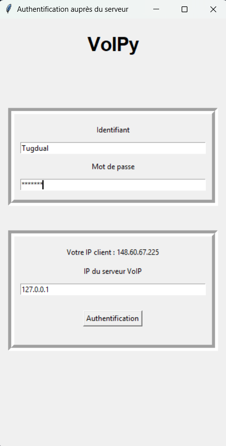
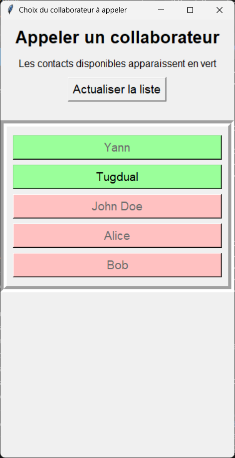
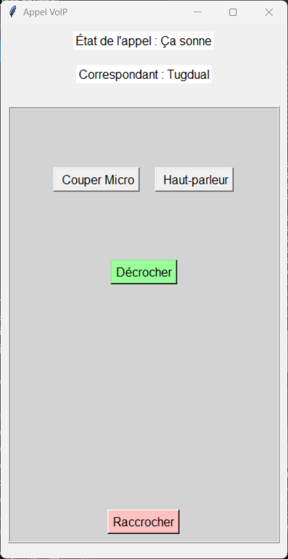
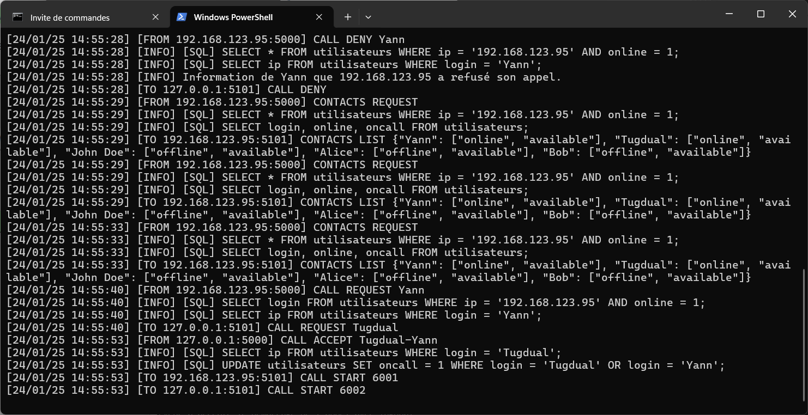

# VoIPy : Projet de VoIP avec Python
L'objectif de ce projet était de développer en programmation orientée objet Python un service VoIP client-serveur. Nous l'avons réalisé dans la cadre d'une Situation d'Apprentissage et d'Évaluation (SAE32) en binôme durant notre S3 de BUT Réseaux et Télécommunications à l'IUT de Lannion.

L'intérêt est de mettre en oeuvre diverses compétences travaillées en cours de POO Python, telles que la création de protocoles applicatifs, d'interfaces homme machine, et l'exploitation du protocole UDP avec Python. Nous profitons également de ce projet pour apprendre à utiliser l'outil git intégré à Visual Studio Code.

Le code est testé pour Python 3.12.8 sur Windows 11, et fonctionne relativement bien sur Debian 12.

## Cahier des charges initial
Le cahier des charges initial, suivant un format majoritairement prédéfini par l'enseignant, est consultable [ici](https://github.com/Yann-Plougonven/VoIPy/blob/main/cahier_des_charges_initial/cahier_des_charges.md#-cahier-des-charges-pr%C3%A9visionnel-). 

## Compte rendu
Le compte rendu du projet, suivant un format majoritairement prédéfini par l'enseignant, est consultable [ici](https://github.com/Yann-Plougonven/VoIPy/blob/main/compte_rendu/Compte-rendu.md).

## Utilisation de VoIPy
Avertissement : VoIPy ne devrait pas être utilisé pour communiquer des informations sensibles. En effet, les communications et le stockage des identifiants ne sont pas sécurisés.

Pour une meilleure expérience, l'installation du logiciel FFMPEG est recommandée.

### 1. Lancement du serveur
Avant tout, il est nécessaire de lancer le serveur dans un terminal via la commande "python *chemin du fichier serveur.py*"

Le serveur devrait alors afficher alors un message indiquant qu'il a démarré correctement.

### 2. Lancement des clients
Ensuite, lancer le programme client (directement depuis VSCode par exemple). Cela affiche l'interface d'authentification.

Se connecter au serveur via un couple login/mdp et en renseignant l'adresse ip du serveur. Cliquer sur "Authentification".

Voici des utilisateurs (login:password) créés pour tester le programme :
* Yann:lannion
* Tugdual:lannion
* John Doe:azerty
* Alice:azerty1
* Bob:123456

Dans la console du serveur, nous pouvons voir que le client s'est connecté proprement et que le serveur met à jour sa BDD contenant le statut des contacts.

### 3. Ouverture de la liste des contacts

Une fois que le client s'est connecté, le programme demande au serveur de lui fournir la liste des contacts.

Lorsque qu'un autre utilisateur se connecte, la base de donnée du serveur se met à jour. Le client doit alors simplement cliquer sur le bouton "Actualiser la liste" pour voir la liste des contacts mise à jour.

Les contacts connectés et disponibles (n'étant pas en appel) apparaissent en vert. Les contacts connectés mais déjà en appel apparaissent en jaune, et les contacts déconnectés en rouge.

### 4. Appel d'un utilisateur

On peut alors cliquer sur un contact affiché en vert, afin  de l'appeler. Le programme envoie alors une requête CALL REQUEST vers le serveur, qui transmet la requete au contact appelé.

Il est également possible de rester attendre sur cette interface qu'un autre utilsateur nous appelle.

Pendant l'attente de réponse du correspondant, l'ihm affiche "ça sonne", et de nouveaux messages s'affichent dans les logs du serveur.

.png)

### 5. Acceptation de l'appel

Côté client appellé, un nouvelle interface apparait avec le nom de l'appellant le bouton "Décrocher" est cliquable.

Quand le client appelé accepte l'appel, il envoie un CALL accept.

Le serveur envoie alors un call start aux deux correspondants, et un message "Appel en cours" s'affiche en haut de l'interface. Pendant l'appel, les deux clients peuvent se parler et s'entendre.

.png)

### 6. Lancement d'appels simultanés

Quand un appel entre deux utilisateurs est en cours, deux autres utilisateurs peuvent également lancer un nouvel appel entre eux, comme le montre le gif suivant :

### 7. Fin de l'appel

Quand deux clients sont en appel, l'un d'eux peut alors appuyer sur le bouton "Raccrocher", ce qui entraine la fin de l'appel pour le serveur et les deux clients.
