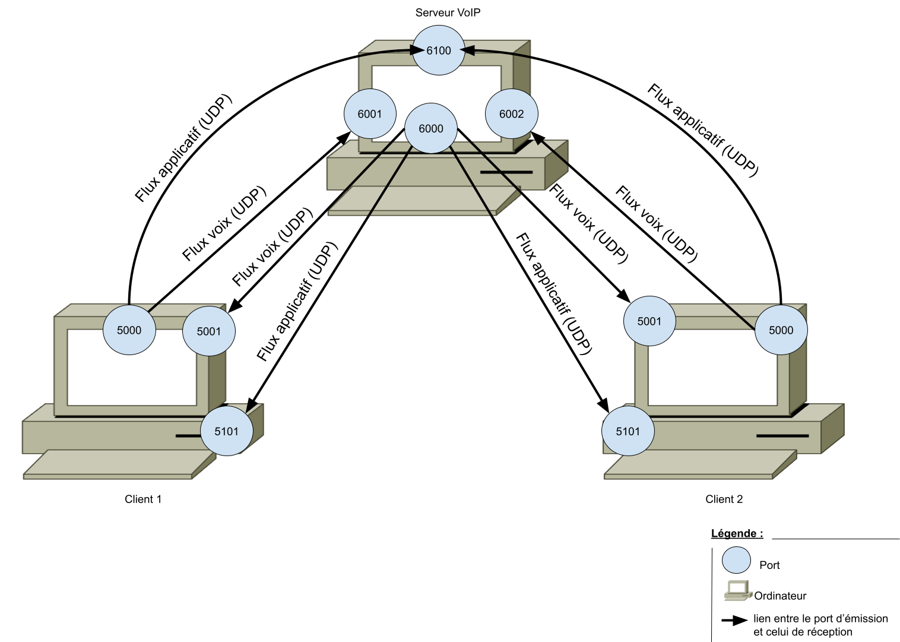
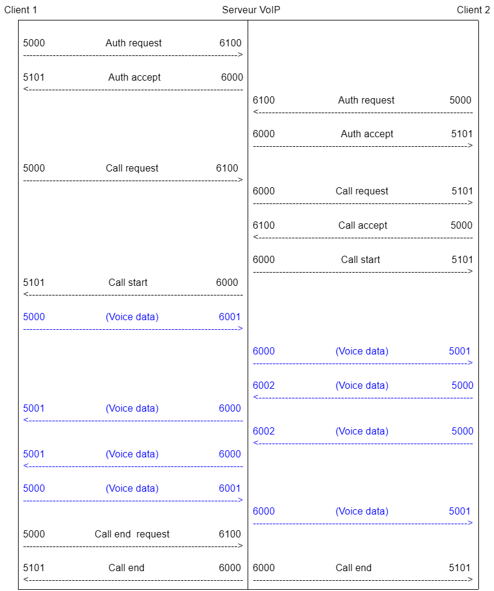
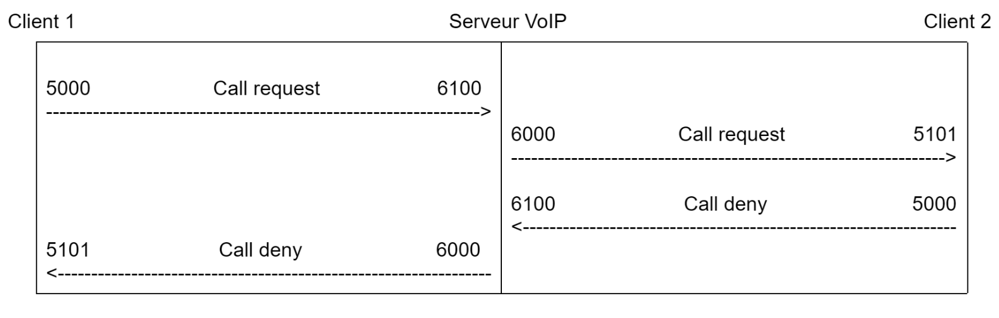
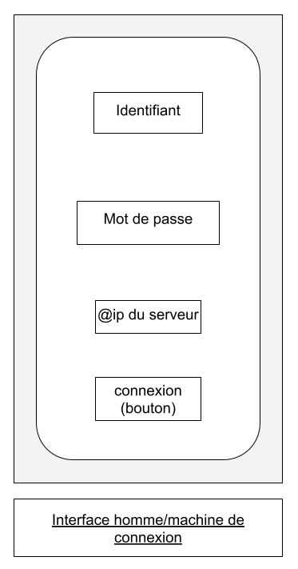
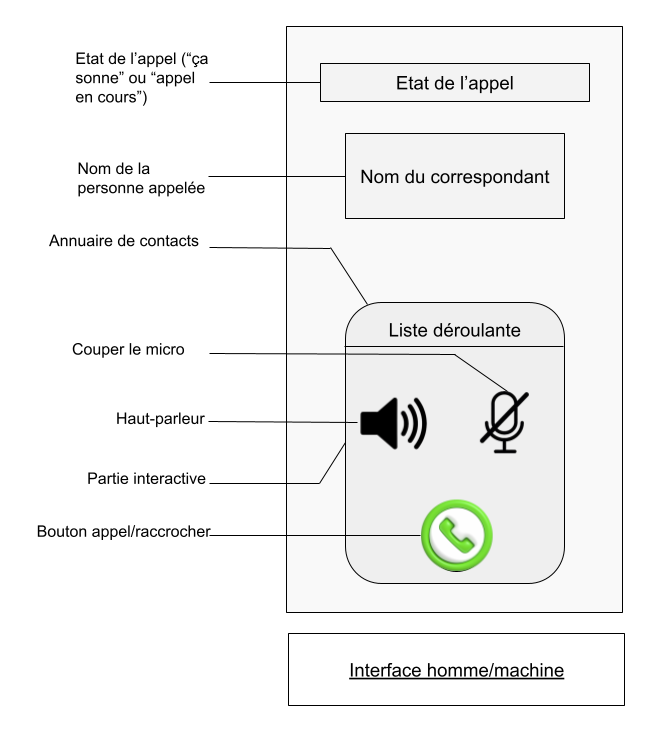

# 
 SAÉ 3.02 : Développer des applications communicantes 

# 
 Cahier des charges prévisionnel 

## 
 BUT2 R&T - IUT LANNION 

### 
 Groupe B1 - Binôme 5 

### 
 Tugdual Thepaut   Yann Plougonven--Lastennet 

# I. Objectif du projet :

L'objectif de ce projet est de développer en programmation orientée objet Python un service VoIP client-serveur.

L'intérêt est de mettre en oeuvre diverses compétences travaillées en cours de POO Python, telles que la création de protocoles applicatifs, d'interfaces homme machine, et l'exploitation du protocole UDP avec Python.

Ce document expose le cahier des charges prévisionnel et simplifié du service.

# II. Schéma de principe réseau

### Ports utilisés :

* **5000 :** port d'émission côté client
* **5001 :** port de réception côté client de la voix
* **5101 :** port de réception côté client du protocole applicatif
* **6000 :** port d'émission côté serveur
* **6000+n :** port de réception côté serveur de la voix du client n
* **6100 :** port de réception côté serveur du protocole applicatif avec tous les clients

On choisit d'utiliser le protocole UDP pour le flux de voix, car ce protocole permet une faible latence par rapport au protocole TCP. Néanmoins, contrairement à TCP, UDP ne retransmet pas les paquets perdus. Cela implique parfois la perte de quelques "bouts" de la voix d'un utilisateur, mais cette perte est imperceptible par l'oreille humaine.
Une forte latence, induite par TCP, serait, elle, très désagréable pour les utilisateurs du service et saturerait plus le réseau.

En accord avec les consignes, on choisit également le protocole UDP pour la transmission du flux applicatif, car il permet de simplifier l'échange de messages entre les clients et le serveur.

# III. Diagrammes d'échange

### Connexion puis établissement, déroulement et fermeture d'un appel :

**Étape 1 :** Les clients utilisent le protocole applicatif ("flux de signalisation") pour demander au serveur VoIP de les authentifier.

**Étape 2 :** Le serveur VoIP accepte l'authentification des clients.

**Étape 3 :** Le client 1 utilise le protocole applicatif pour demander au serveur VoIP d'appeler le client 2.

**Étape 4 :** Le serveur transmet la demande au client 2.

**Étape 5 :** Le client 2 informe le serveur qu'il accepte l'appel.

**Étape 6 :** Le serveur informe les deux clients que l'appel est lancé.

**Étape 7 (en bleu) :** Les clients échangent les données de voix en passant par le serveur.

**Étape 8 :** Le client 1 utilise le protocole applicatif pour informer le serveur qu'il raccroche.

**Étape 9 :** Le serveur informe le client 2 que l'appel est terminé.

### Refus d'un appel :

**Étape 1 :** Le client 1 utilise le protocole applicatif ("flux de signalisation") pour demander au serveur VoIP d'appeller le client 2.

**Étape 2 :** Le serveur transmet la demande au client 2.

**Étape 3 :** Le client 2 informe le serveur qu'il refuse l'appel.

**Étape 4 :** Le serveur informe le client 1 que l'appel est refusé.

# IV. Base de donnée du serveur

Voici un extrait de la base de données prévisionnelle du serveur.

|id_client|mdp_client|ip_client|
|---      |:-:     |:-:          |
|1        |lannion |192.168.10.1 |
|2        |123456  |192.168.10.10|
|3        |azerty  |192.168.10.20|

# V. Maquette de l'IHM

### Interface affichée avant l'authentification :

 

### Interface affichée après l'authentification :

