# 
 SAÉ 3.02 : Développer des applications communicantes 

# 
 Compte-rendu de projet 

## 
 BUT2 R&T - IUT LANNION 

### 
 Groupe B1 - Binôme 5 

### 
 Tugdual Thepaut   Yann Plougonven--Lastennet 

# I. Objectif du projet :

L'objectif de ce projet est de développer en programmation orientée objet Python un service VoIP client-serveur. Réalisé dans la cadre d'une Situation d'Apprentissage et d'Évaluation (SAE32) en binôme durant notre S3 de BUT Réseaux et Télécommunications à l'IUT de Lannion.

L'intérêt est de mettre en oeuvre diverses compétences travaillées en cours de POO Python, telles que la création de protocoles applicatifs, d'interfaces homme machine, et l'exploitation du protocole UDP avec Python. Nous profitons également de ce projet pour apprendre à utiliser l'outil git intégré à Visual Studio Code.

Le code est testé pour Python 3.12.8 sur Windows 11, et fonctionne relativement bien sur Debian 12.

# II. Utilisation du logiciel

### 1. Lancement du serveur
Avant tout, il est nécessaire de lancer le serveur dans un terminal via la commande "python *chemin du fichier serveur.py*"

Le serveur devrait alors afficher alors un message indiquant qu'il a démarré correctement.

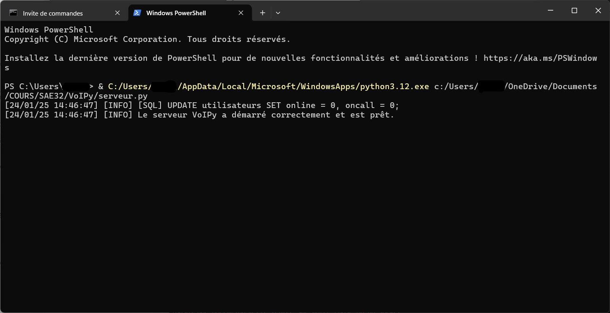

### 2. Lancement des clients
Ensuite, lancer le programme client (directement depuis VSCode par exemple). Cela affiche l'interface d'authentification.

Se connecter au serveur via un couple login/mdp et en renseignant l'adresse ip du serveur. Cliquer sur "Authentification".

Voici des utilisateurs (login:password) créés pour tester le programme :
* Yann:lannion
* Tugdual:lannion
* John Doe:azerty
* Alice:azerty1
* Bob:123456

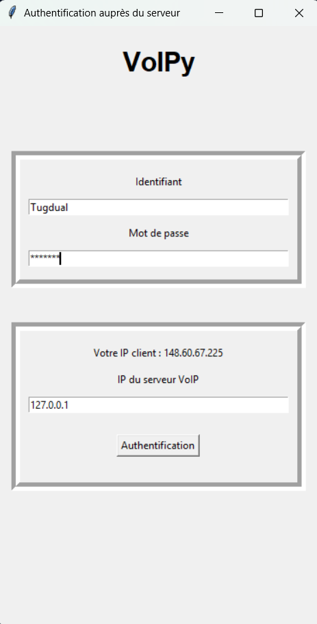

Dans la console du serveur, nous pouvons voir que le client s'est connecté proprement et que le serveur met à jour sa BDD contenant le statut des contacts.

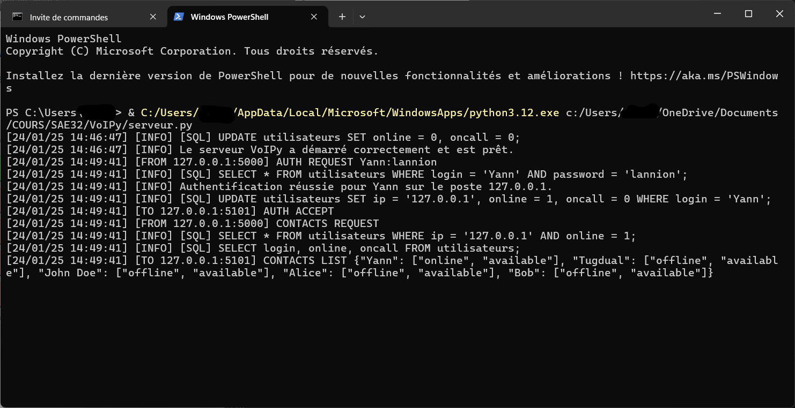

### 3. Ouverture de la liste des contacts

Une fois que le client s'est connecté, le programme demande au serveur de lui fournir la liste des contacts.

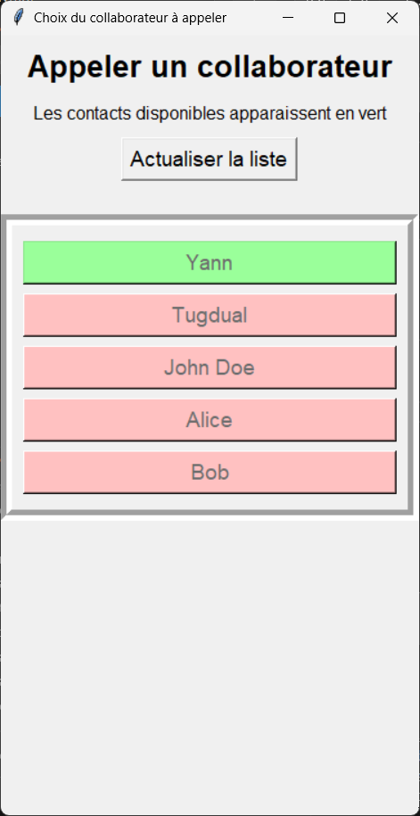

Lorsque qu'un autre utilisateur se connecte, la base de donnée du serveur se met à jour. Le client doit alors simplement cliquer sur le bouton "Actualiser la liste" pour voir la liste des contacts mise à jour.

Les contacts connectés et disponibles (n'étant pas en appel) apparaissent en vert. Les contacts connectés mais déjà en appel apparaissent en jaune, et les contacts déconnectés en rouge.

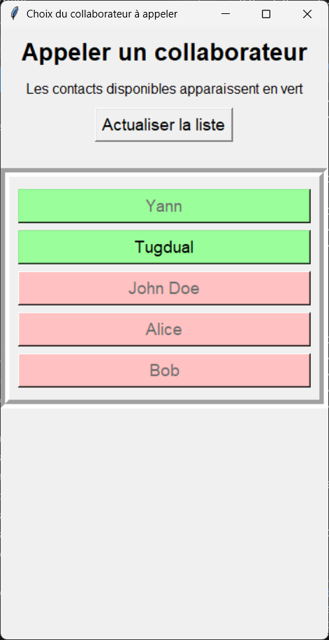

### 4. Appel d'un utilisateur

On peut alors cliquer sur un contact affiché en vert, afin  de l'appeler. Le programme envoie alors une requête CALL REQUEST vers le serveur, qui transmet la requete au contact appelé.

Il est également possible de rester attendre sur cette interface qu'un autre utilsateur nous appelle.

Pendant l'attente de réponse du correspondant, l'ihm affiche "ça sonne", et de nouveaux messages s'affichent dans les logs du serveur.

.png)

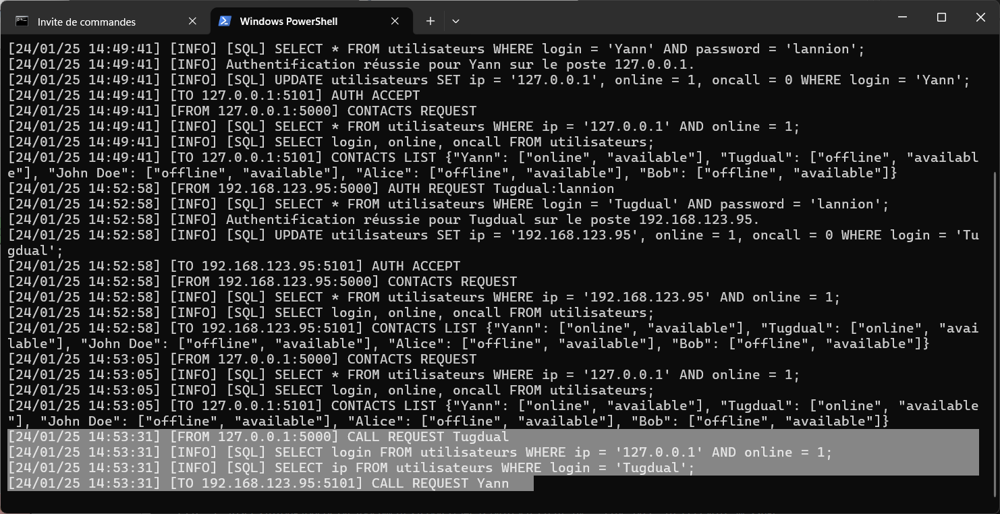

### 5. Acceptation de l'appel

Côté client appellé, un nouvelle interface apparait avec le nom de l'appellant le bouton "Décrocher" est cliquable.

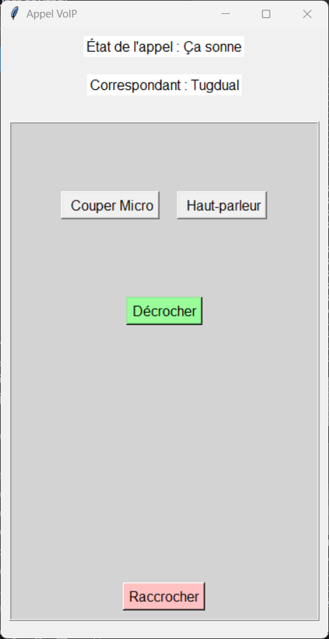

Quand le client appelé accepte l'appel, il envoie un CALL accept.

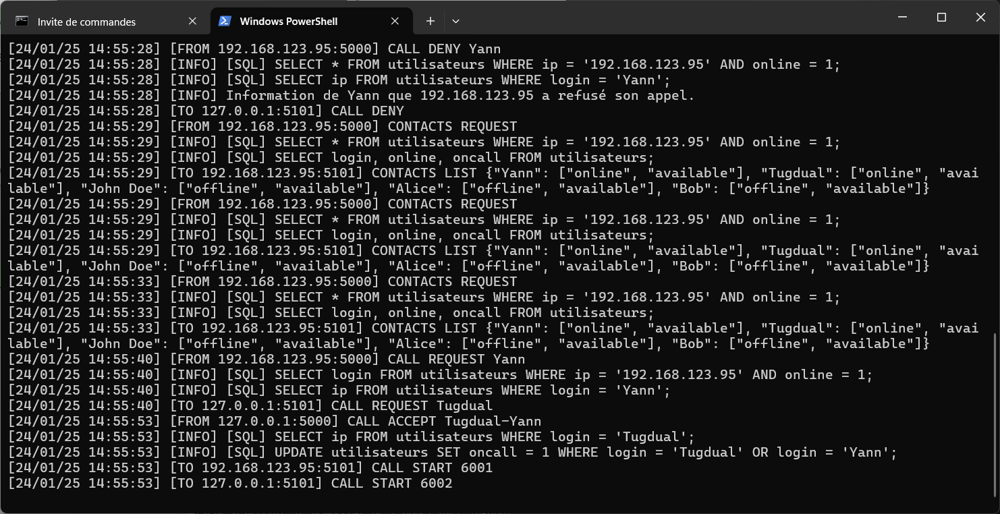

Le serveur envoie alors un call start aux deux correspondants, et un message "Appel en cours" s'affiche en haut de l'interface. Pendant l'appel, les deux clients peuvent se parler et s'entendre.

.png)

### 6. Lancement d'appels simultanés

Quand un appel entre deux utilisateurs est en cours, deux autres utilisateurs peuvent également lancer un nouvel appel entre eux, comme le montre le gif suivant :

**Note :** Cette fonctionnalité n'était pas au point pour la soutenance, car nous n'avions pas pu la tester avec suffisemment d'utilisateurs. Elle est maintenant au point, seules quelques lignes de code côté serveur ont été modifiées.

### 7. Fin de l'appel

Quand deux clients sont en appel, l'un d'eux peut alors appuyer sur le bouton "Raccrocher", ce qui entraine la fin de l'appel pour le serveur et les deux clients.

# III. Tableaux comparatifs entre le cahier des charges et le projet final

# Comparatif entre le cahier des charges et le projet fini

| Élément                     | Cahier des charges                                                                                       | Projet fini                                                                                          |
|-----------------------------|---------------------------------------------------------------------------------------------------------|------------------------------------------------------------------------------------------------------|
| **Ports utilisés**          | * **5000 :** port d'émission côté client   * **5001 :** port de réception côté client de la voix   * **5101 :** port de réception côté client du protocole applicatif   * **6000 :** port d'émission côté serveur   * **6000+n :** port de réception côté serveur de la voix du client n   * **6100 :** port de réception côté serveur du protocole applicatif avec tous les clients | Identique au cahier des charges                                                                      |
| **Diagramme d'échange**     | 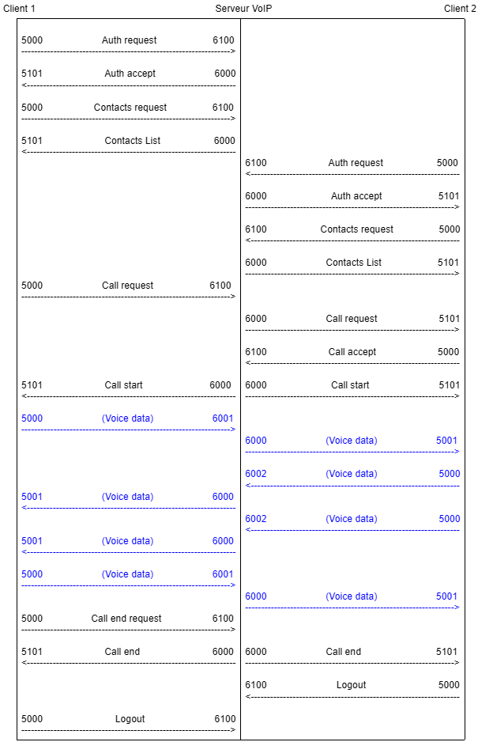        | 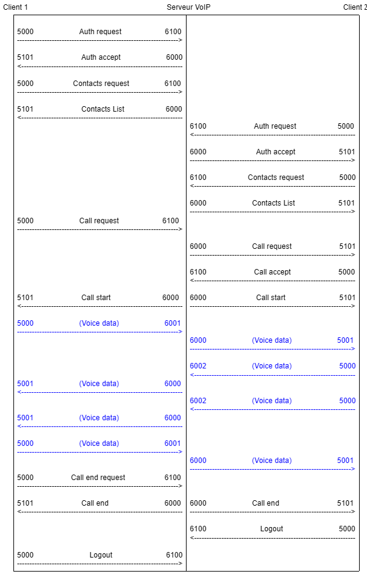
| **Maquette de l'IHM**       | Nous avions 2 interfaces : une pour l'authentification et un pour l'appel .png) .png)|Nous avons maintenant une interface de plus, permettant de sélectionner le contact à appeller de manière plus simple qu'en utilisant la liste déroulante de l'interface d'appel initilialement prévue.  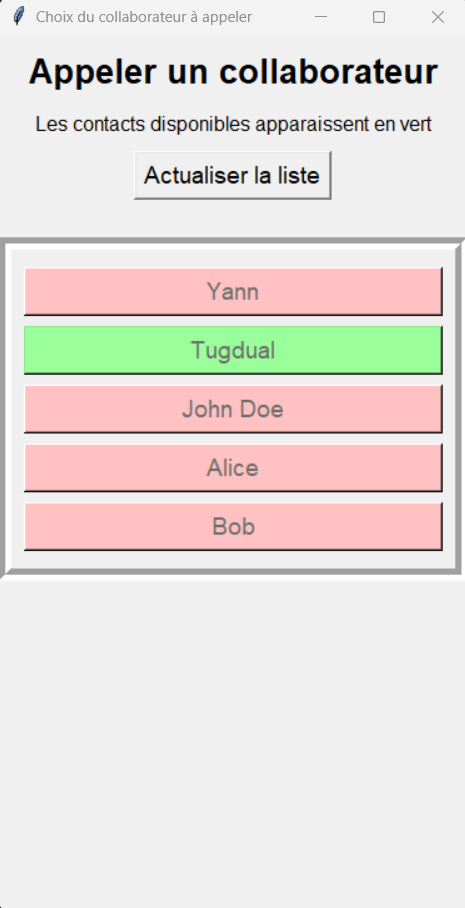 .png)                                                                                        |
| **Format JSON**             | Initialement, même si le cahier des charges fourni en cours nous indiquer d'utiliser la sérialisation/désérialisation de données JSON, l'enseignant nous avait indiqué qu'il n'était pas nécessaire d'utiliser le format JSON.                                                                                                | Lors de la soutenance, il nous a finalement été demandé de faire de la sérialisation/désérialisation de données JSON. Nous avons donc implémenté cette fonctionnalité en remplaçant quelques lignes de code, pour l'envoi et la réception de la liste des contacts et de leur statut.                                                                                             |
| **Base de données**         | 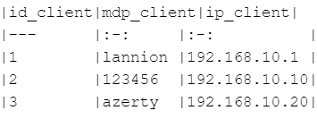          | 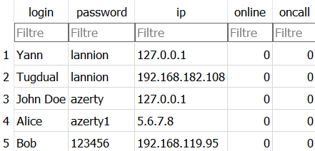                                                          |
|**Gestion d'appels multiples**| Il était prévu que le serveur puisse gérer plusieurs appels en parallèle. | Cette fonctionnalité n'avait pas pu être testée avant la soutenance. Nous avons entre temps corrigé les quelques lignes de code qui empêchaient la bonne transmission de la voix lorsque deux appels étaient gérés en parallèle par le serveur.  |

# IV. Diagramme de Gantt

Ce diagramme de Gantt simplifié restranscrit l'organisation des grandes lignes du projet.

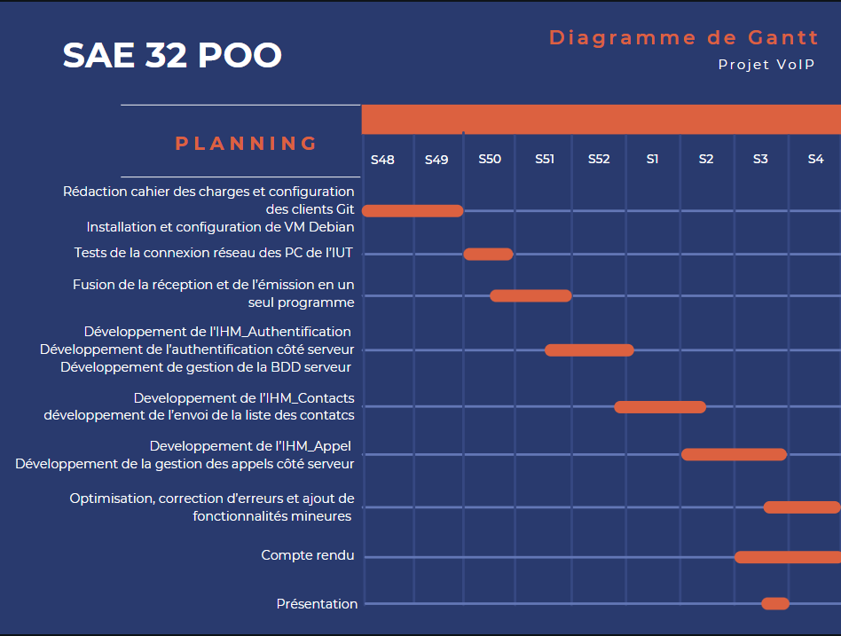

# V. Diagramme des classes

## Client

### IHM_Authentification(Tk)

| Attributs        |
|------------------|
| __label_erreur   |
| __frame_auth     |
| __entry_login    |
| __label_login    |
| __entry_mdp      |
| __label_mdp      |
| __frame_serv     |
| __label_ip_client|
| __entry_ip_serv  |
| __btn_auth       |
| __label_titre    |

| Méthode                          | Description                                                                                                   |
|----------------------------------|---------------------------------------------------------------------------------------------------------------|
| \_\_init\_\_(self, msg_erreur:str=””)| Constructeur de la classe définissant l'inteface graphique d'authentification du client VoIP auprès du serveur VoIP. d'authentification.|
| creer_utilisateur(self)          | Créer un objet Utilisateur à partir des informations renseignées dans les champs de l'IHM d'authentification.|
| quit(self)                       | Gestion de la fermeture de la fenêtre de l'IHM d'authentification.|

### IHM_Contacts(Tk)

| Attributs                   |
|-----------------------------|
| __utilisateur               |
| __login_utilisateur         |
| __ihm_appel                 |
| __stop_thread_ecoute        |
| __thread_ecoute             |
| __frame_contacts            |
| __label_titre               |
| __label_sous_titre          |
| __btn_actualiser            |

| Méthode                                       | Description                                                                                   |
|-----------------------------------------------|-----------------------------------------------------------------------------------------------|
| \_\_init\_\_(self)                                | Constructeur de la classe définissant l'interface graphique des contacts du client VoIP.|
| lister_contacts(self) → None                 | Actualise la liste des contacts disponibles et gère les exceptions en cas d'erreurs.|
| appeler_correspondant(self, correspondant:str)| Instancie l'interface d'appel avec le correspondant sélectionné. Pour cela, arrête arrête d'abord l'écoute de requête d'appel pour éviter les interférences.|
| ecouter_requete_appel(self) → None           | Ecoute en arrirère-plan des potentielles requêtes d'appel entrantes.|
| demarrer_deamon_ecoute_requetes_appel(self)  | Lance un thread qui écoute les requêtes d’appel en arrière-plan.|
| stopper_deamon_ecoute_requetes_appel(self, timeout:float=190) → None | Arrête le thread d’écoute pour éviter les interférences.|
| ouvrir_ihm_appel(self, correspondant:str) → None | correspondant (str): login du correspondant qui a demandé l'appel.|
| quit(self) → None                            | Gérer la fermeture de l'IHM client : déconnexion de l'utilisateur et fermeture de la fenêtre.|

### IHM_Appel(Tk)

| Attributs                  |
|----------------------------|
| __utilisateur              |
| __login_utilisateur        |
| __correspondant            |
| __le_client_est_l_appellant|
| __appel_en_cours           |
| __label_etat_appel         |
| __cadre_interactif         |
| __bouton_micro             |
| __bouton_hp                |
| __bouton_decrocher         |
| __bouton_raccrocher        |

| Méthode                                          | Description                                                                                     |
|--------------------------------------------------|-------------------------------------------------------------------------------------------------|
| \_\_init\_\_(self)                                   | Constructeur de la classe définissant l'interface graphique d'appel VoIP.|
| envoyer_requetes_appel(self) → None             | Appel la méthode envoyer_requete_appel de l'objet utilisateur pour envoyer une requête d'appel au serveur. Adapte l'interface en fonction de la réponse du serveur.|
| decrocher(self) → None                          | Appel des fonctions de décrochage de l'appel et de démarrage de l'appel. Mise à jour de l'interface en en attendant le démarrage de l'appel.|
| demarrer_appel(self, autorisation_de_demarrer_l_appel:bool, port_reception_voix_du_serveur:int) → None | Démarrer l'appel avec le correspondant. Mise à jour de l'interface en conséquence et appel de la méthode demarrer_appel de l'objet utilisateur.|
| raccrocher(self) → None                         | Raccrocher l'appel. Si l'appel est en cours, demande au serveur de raccrocher. Si l'appel n'a pas été accepté, demande au serveur de refuser l'appel.|
| couper_micro(self) → None                       | Fonction pour couper le micro (non implémentée).|
| activer_hp(self) → None                         | Fonction pour activer le haut-parleur (non implémentée).|
| fermer_ihm_appel(self) → None                   | Ferme l’interface d’appel.|
| quit(self) → None                               | Déconnecte l’utilisateur et termine l’appel en cas de fermeture forcée.|

### Utilisateur

| Attributs                  |
|----------------------------|
| __login                    |
| __mdp                      |
| __ip_serv                  |
| __stop_appel               |
| __ihm_appel                |
| __flux_emission            |
| __flux_reception           | 
| __audio                    | 
| __socket_envoie            |
| __socket_reception         |
| __socket_reception_voix    |

| Méthode                                         | Description                                                                                     |
|------------------------------------------------|-------------------------------------------------------------------------------------------------|
| \_\_init\_\_(self, login:str, mdp:str, ip_serv:str) | Initialise les attributs pour gérer l’utilisateur, l’authentification, et les appels.|
| authentification(self) → None                  | Gère l'authentification de l'utilisateur avec le serveur.|
| deconnexion(self) → None                       | Informe le serveur de la déconnexion de l'utilisateur.|
| envoyer_message(self, msg:str) → None          | Envoie un message texte au serveur via le socket d’envoi.|
| recevoir_message(self) → str                   | Reçoit un message texte du serveur via le socket de réception.|
| actualiser_liste_contacts(self) → str          | Récupère la liste des contacts disponibles au format dictionnaire via JSON.|
| envoyer_requete_appel(self, correspondant:str) → tuple[bool, int] | Traite les requêtes d’appel pour un correspondant spécifique.|
| decrocher(self, login_correspondant, login_utilisateur) → tuple[bool, int] | Accepte un appel entrant et retourne les informations nécessaires pour démarrer l’appel.|
| rejeter_appel(self, correspondant) → None      | Permet de refuser un appel et de fermer l’IHM d’appel.|
| demarrer_appel(self, port_reception_voix_du_serveur:int) → None | Gère le démarrage d’un appel après validation par le serveur.|
| raccrocher(self) → None                        | Termine un appel en cours et informe le serveur de la fin de l’appel.|
| terminer_appel(self, ouvrir_ihm_contacts:bool) → None | Termine un appel et réouvre l’IHM des contacts si nécessaire.|
| get_login(self) → str                          | Retourne le login de l'utilisateur.|
| set_timeout_socket_reception(self, timeout:float=180) → None | Définit un délai pour le socket de réception.|
| set_attribut_ihm_appel(self, ihm_appel:IHM_Appel) → None | Permet à la classe Utilisateur d’interagir avec l’IHM d’appel.|

## Serveur

### Service_Signalisation
| Attributs                  |
|----------------------------|
|__socket_ecoute|
|__socket_emission|
|_liste_appels|
|__liste_ports_reception_utilises|
|__dossier_de_travail|

| Méthode                                         | Description                                                                                     |
|------------------------------------------------|-------------------------------------------------------------------------------------------------|
|\_\_init\_\_(self)-> None:|Constructeur de la classe Service_Signalisation. Initialisation des sockets d'écoute et d'émission du flux de signalisation, ect.|
|ecouter_signalisation(self)-> None :|Boucle d'écoute permanente des messages de signalisation. Quand un message est reçu, la méthode traiter_signalisation() est appelée.|
|traiter_signalisation(self,ip_client:str,msg:str)-> None:|Traite les messages de signalisation reçus. Appelle la méthode correspondante à chaque type de message reçu.|
|envoyer_signalisation|Envoie un message de signalisation à un client.|
|log|Ajoute l'heure au début du message de log, enregistre le message et l'affiche dans la console.|
|requete_BDD|Connecte le programme à la base de données, exécute la requête SQL et retourne la réponse.|
|authentifier(self, ip_client:str,msg:str)-> None:|Authentifie un utilisateur en vérifiant son login et son mot de passe dans la BDD.|
|is_ip_authentifiée(self, ip_client:str)-> bool:|Retourne True si un utilisateur est authentifié sur l'IP du client solicitant le serveur, False sinon. (Il ne s'agit évidement pas d'une méthode d'authentification très sécurisée, mais d'une simple vérification de l'IP pour limiter les risques d'usurpation d'identité. Il faudrait ajouter d'autres méthodes de sécurisation)|
|deconnecter(self, ip_client:str, msg: str)-> None:|Déconnecter à utilisateur à sa demande. Met à jour la BDD du serveur en conséquence.|
|envoyer_liste_contacts(self, ip_client:str)-> None:|Envoyer la liste des contacts et de leur statut à l'utilisateur qui en fait la demande. La liste est récupérée dans la BDD et envoyée au client sous forme de fichier JSON.|
|requete_appel(self, ip_appelant:str, msg: str)-> None:|Quand un utilisateur demande à appeller un autre utilisateur, envoyer une requête d'appel à l'utilisateur appelé.|
|lancer_appel(self, ip_appele:str, msg: str)-> None:|Lancer un appel entre deux utilisateurs, dans un objet appel dédié,  fonctionnant dans un thread pour ne pas bloquer le service signalisation. Définit un port de réception de la voix pour chaque correspondant. Informe les correspondants du début de l'appel et leur fourni les ports de réception de la voix côté serveur.|
|rejeter_appel(self, ip_appele:str, msg: str)-> None:|Refuser un appel entrant, à la demande du client appelé.|
|terminer_appel(self, ip_client:str)-> None:|Termine un appel en cours|
### Appel(Thread)
| Attributs                  |
|----------------------------|
| __login                    |
|__stop_thread_event|
|__ip_appelant|
|__ip_appele1|
|__port_reception_appelant|
|__port_reception_appele1|
|__socket_emission|
|__socket_reception_appelant|
|__socket_reception_appele1|

| Méthode                                         | Description                                                                                     |
|------------------------------------------------|-------------------------------------------------------------------------------------------------|
|\_\_init\_\_(self, socket_emission, correspondants:list[list[str, int]]) -> None:|Constructeur de la classe Appel. Une classe Appel est un thread créé pour la gestion d'un appel.|
|run(self) -> None:|Méthode de transfert en boucle des paquets de voix entre les deux correspondants.|
|terminer_appel(self) -> None:|Terminer un appel en cours. Déclenche l'event de fin de la boucle de transfert de la voix et la fin du thread.|
|get_ip_clients(self)-> list[str]:|Retourne les IP des clients de l'appel.|
|get_ports_receptions_individuels(self)-> list[int]:|Retourne la liste des ports serveur dédiés à la réception des flux audio des clients de l'appel.|

# VI. Conclusion

En conclusion, nous pensons que ce projet a été très enrichissant. En effet, nous avons découvert de nouvelles fonctionnalités et de nouvelles méthodes permettant de développer en Python et de résoudre certains problèmes rencontrés. Nous avons trouvé certains aspects du projet complexes, mais cela nous a permis de perfectionner nos techniques de développement. Ce projet nous a également permis de monter en compétences dans d'autres domaines comme l'utilisation de GitHub, la communication et la gestion de projet.